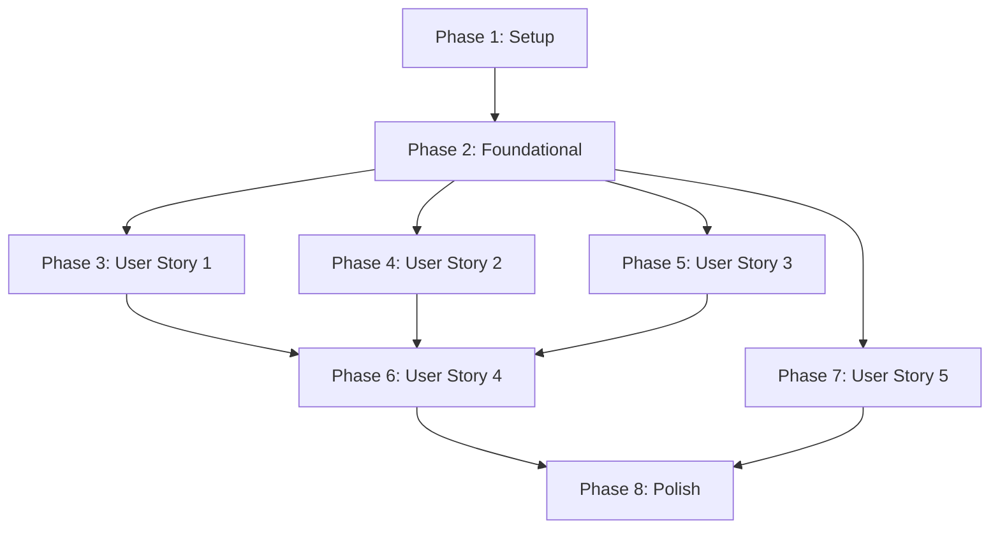

# Implementation Execution Plan: Twitch Emote MVP
**Feature**: 001-twitch-emote-mvp  
**Generated**: 2025-12-24  
**Total Tasks**: 120 tasks across 8 phases

---

## Executive Summary

### Current Status: Foundation Partially Complete ✅

**Completed Work**:
- ✅ Basic monorepo structure established
- ✅ Shared types and constants implemented
- ✅ Database client configuration complete
- ✅ Database schema migrations created
- ✅ Linting and formatting configs in place

**Remaining Work**: ~100+ tasks across implementation phases
- Backend API endpoints and services
- Frontend components and pages  
- Integration and deployment
- Polish and testing

**Critical Path**: Phase 2 (Foundational) must complete before any user story work begins

---

## Current State Analysis

### ✅ Already Implemented (Confirmed via file inspection)

#### Phase 1: Setup (12 tasks)
- ✅ T001: Monorepo structure exists (backend/, frontend-extension/, frontend-website/, shared/)
- ✅ T007-T009: ESLint/Prettier configs exist in all projects
- ✅ T010: pnpm workspace configuration exists (.pnpm-workspace.yaml)
- ✅ T011: wrangler.toml exists
- ✅ T012: .env.example files exist in all projects

**Note**: Package.json files exist but may need dependency verification

#### Phase 2: Foundational (30 tasks)
- ✅ T013-T016: Database migrations created (001_initial_schema.sql, 002_draw_card_function.sql, seed scripts)
- ✅ T017-T024: Shared types and constants implemented (shared/types.ts, shared/constants.ts)
- ✅ T026: Supabase client configuration complete (backend/src/db/client.ts)

**Partially Complete**: Some foundational infrastructure exists but many services/middleware are missing

### 🔨 Needs Implementation

**High Priority - Blocking Work**:
1. Backend middleware (auth, error handling, CORS, logging, rate limiting)
2. Backend services (RNG, ticket regeneration, card service, user service, draw service)
3. Backend API routes (cards, users, draws, health)
4. Frontend infrastructure (API clients, hooks, utilities)

**Medium Priority - User Stories**:
5. User Story 1: View/collect cards functionality
6. User Story 2: Draw mechanics
7. User Story 3: Ticket regeneration display

**Lower Priority**:
8. User Story 4: Deployment configuration
9. User Story 5: Stats and progress tracking
10. Phase 8: Polish and testing

---

## Execution Strategy

### Phase Breakdown

### Critical Dependencies

**BLOCKER**: Phase 2 (Foundational) must be 100% complete before ANY user story work
- Backend middleware and services are dependencies for all endpoints
- Frontend infrastructure is required for all UI components

**MVP Core** (Must have for basic functionality):
- User Story 1: View cards
- User Story 2: Draw cards  
- User Story 3: Ticket regeneration

**Post-MVP** (Can defer):
- User Story 4: Deployment (needed for production but not local dev)
- User Story 5: Stats/progress (engagement feature, not core mechanic)
- Phase 8: Polish (quality improvements)

---

## Detailed Task List by Phase

### Phase 2: Foundational Infrastructure (CRITICAL - In Progress)

#### Backend Middleware (Sequential)
- [ ] T027: Twitch JWT authentication middleware (backend/src/middleware/auth.ts)
- [ ] T028: Error handling middleware (backend/src/middleware/error.ts)
- [ ] T029: CORS middleware (backend/src/middleware/cors.ts)
- [ ] T030: Logging middleware (backend/src/middleware/logger.ts)
- [ ] T031: Hono app initialization with middleware (backend/src/index.ts)

#### Backend Services (Some Parallel)
- [ ] T032: RNG service interface (backend/src/services/rng.interface.ts)
- [ ] T033: ProductionRNG implementation (backend/src/services/rng.production.ts)
- [ ] T034: [P] TestRNG implementation (backend/src/services/rng.test.ts)
- [ ] T035: Ticket regeneration service (backend/src/services/ticket-regeneration.ts)
- [ ] T036: Health check endpoint (backend/src/api/routes/health.ts)

#### Frontend Extension Infrastructure
- [ ] T037: Twitch Extension SDK integration (frontend-extension/src/App.tsx)
- [ ] T038: API client service (frontend-extension/src/services/api.ts)
- [ ] T039: [P] Error handling utilities (frontend-extension/src/utils/errors.ts)
- [ ] T040: [P] Date formatting utilities (frontend-extension/src/utils/format.ts)

#### Frontend Website Infrastructure
- [ ] T041: Supabase Auth client (frontend-website/src/services/supabase.ts)
- [ ] T042: API client service (frontend-website/src/services/api.ts)
- [ ] T043: Routing configuration (frontend-website/src/App.tsx)

**Checkpoint**: ✋ All foundational tasks must complete before proceeding

---

### Phase 3: User Story 1 - View and Collect Cards

#### Backend (Sequential within groups, groups can overlap)
- [ ] T044: [P] Card model types (backend/src/models/card.ts)
- [ ] T045: [P] User model types (backend/src/models/user.ts)
- [ ] T046: CardService (backend/src/services/card.service.ts)
- [ ] T047: UserService (backend/src/services/user.service.ts)
- [ ] T048: GET /api/v1/cards endpoint (backend/src/api/routes/cards.ts)
- [ ] T049: GET /api/v1/cards/:id endpoint (backend/src/api/routes/cards.ts)
- [ ] T050: GET /api/v1/users/me/collection endpoint (backend/src/api/routes/users.ts)
- [ ] T051: Register routes (backend/src/api/index.ts)

#### Frontend Extension (Some Parallel)
- [ ] T052: [P] CardGrid component (frontend-extension/src/components/CardGrid.tsx)
- [ ] T053: [P] CardDetails component (frontend-extension/src/components/CardDetails.tsx)
- [ ] T054: [P] useCardCollection hook (frontend-extension/src/hooks/useCardCollection.ts)
- [ ] T055: Collection page (frontend-extension/src/pages/Collection.tsx)
- [ ] T056: Loading states and error handling
- [ ] T057: Visual distinction for owned vs unowned cards

#### Frontend Website
- [ ] T058: [P] Leaderboard component (frontend-website/src/components/Leaderboard.tsx)
- [ ] T059: Leaderboard page (frontend-website/src/pages/Leaderboard.tsx)

**Checkpoint**: ✋ Test User Story 1 independently before proceeding

---

### Phase 4: User Story 2 - Draw Cards

#### Backend
- [ ] T060: [P] DrawTransaction model types (backend/src/models/draw-transaction.ts)
- [ ] T061: [P] TicketBalance model types (backend/src/models/ticket-balance.ts)
- [ ] T062: DrawService with full draw flow (backend/src/services/draw.service.ts)
- [ ] T063: Duplicate detection logic in DrawService
- [ ] T064: POST /api/v1/draws endpoint (backend/src/api/routes/draws.ts)
- [ ] T065: Register draws route (backend/src/api/index.ts)
- [ ] T066: Rate limiting middleware for draws (backend/src/middleware/rate-limit.ts)

#### Frontend Extension
- [ ] T067: [P] DrawButton component (frontend-extension/src/components/DrawButton.tsx)
- [ ] T068: [P] DrawResult modal (frontend-extension/src/components/DrawResult.tsx)
- [ ] T069: [P] useDrawCard hook (frontend-extension/src/hooks/useDrawCard.ts)
- [ ] T070: Draw page (frontend-extension/src/pages/Draw.tsx)
- [ ] T071: Draw animation and result display
- [ ] T072: Error handling for insufficient tickets
- [ ] T073: Integrate with Collection page

**Checkpoint**: ✋ Test User Stories 1 + 2 together

---

### Phase 5: User Story 3 - Ticket Regeneration

#### Backend
- [ ] T074: GET /api/v1/users/me/tickets endpoint (backend/src/api/routes/users.ts)
- [ ] T075: Integrate ticket regeneration in DrawService
- [ ] T076: Ticket balance validation and error responses

#### Frontend Extension
- [ ] T077: [P] TicketDisplay component (frontend-extension/src/components/TicketDisplay.tsx)
- [ ] T078: [P] useTicketBalance hook (frontend-extension/src/hooks/useTicketBalance.ts)
- [ ] T079: Countdown timer for next ticket
- [ ] T080: Integrate TicketDisplay in Draw page
- [ ] T081: Ticket balance polling (30 req/min max)
- [ ] T082: Disable draw button when tickets are zero

**Checkpoint**: ✋ MVP complete - all P1 stories functional

---

### Phase 6: User Story 4 - Deployment (18 tasks)
**Status**: Post-MVP, needed for production deployment
**Tasks**: T083-T093 (Twitch Extension deployment, Cloudflare Workers deployment)

### Phase 7: User Story 5 - Progress/Stats (12 tasks)
**Status**: Enhancement feature (P3 priority)
**Tasks**: T094-T105 (Stats aggregation, progress indicators)

### Phase 8: Polish & Cross-Cutting (15 tasks)
**Status**: Quality improvements
**Tasks**: T106-T120 (Documentation, performance, security, cleanup)

---

## Parallel Execution Opportunities

### Within Foundational Phase
**Can run simultaneously**:
- T028, T029, T030 (different middleware files)
- T034 (TestRNG while ProductionRNG being built)
- T039, T040 (frontend utilities)

### Within User Story 1
**Can run simultaneously**:
- T044, T045 (different model files)
- T052, T053, T054 (different component files)
- T058 (website component, independent from extension)

### Within User Story 2
**Can run simultaneously**:
- T060, T061 (different model files)
- T067, T068, T069 (different component files)

### Within User Story 3
**Can run simultaneously**:
- T077, T078 (different files)

---

## Risk Assessment

### 🔴 High Risk
1. **Database migrations not applied**: Need to verify Supabase has schema
2. **Environment variables not configured**: .env files need actual values
3. **Dependencies not installed**: package.json files exist but deps may not be installed
4. **Twitch Extension registration**: Need actual Twitch app for testing

### 🟡 Medium Risk
1. **API contract alignment**: Ensure backend responses match frontend expectations
2. **RLS policies**: Database security needs testing with actual auth
3. **Rate limiting**: Need to implement and test limits
4. **CORS configuration**: Must allow frontend origins

### 🟢 Low Risk
1. **TypeScript compilation**: Strict mode configs exist
2. **Code formatting**: Prettier configs standardized
3. **Project structure**: Architecture is well-defined

---

## Pre-Implementation Checklist

Before switching to Code mode, verify:

### Environment Setup
- [ ] Supabase project created and accessible
- [ ] Database migrations applied to Supabase
- [ ] Twitch Developer account and extension registered
- [ ] Cloudflare Workers account set up
- [ ] Environment variables documented

### Dependencies
- [ ] Run `pnpm install` in project root
- [ ] Verify all package.json dependencies are installed
- [ ] Test that TypeScript compilation works
- [ ] Verify ESLint/Prettier run without errors

### Database Verification
- [ ] Confirm tables exist in Supabase
- [ ] Verify RLS policies are active
- [ ] Test database connection from local backend
- [ ] Seed initial emote data

### Development Workflow
- [ ] Local backend can start (wrangler dev)
- [ ] Local frontends can start (vite dev)
- [ ] Health endpoint returns 200 OK
- [ ] Can generate test Twitch JWT

---

## Recommended Implementation Order

### Sprint 1: Foundation (Week 1)
**Goal**: Complete Phase 2 - Foundational infrastructure

1. Backend middleware (T027-T031)
2. Backend services (T032-T036)
3. Frontend infrastructure (T037-T043)
4. Verify all services can communicate

**Deliverable**: Backend API responds to requests, frontends can call API

---

### Sprint 2: MVP Core (Week 2-3)
**Goal**: Implement P1 user stories

1. **User Story 1** (T044-T059): View cards
   - Backend models and services
   - API endpoints
   - Frontend components
   - Test independently

2. **User Story 2** (T060-T073): Draw cards
   - Backend draw service
   - Draw endpoint
   - Frontend draw UI
   - Test with User Story 1

3. **User Story 3** (T074-T082): Tickets
   - Ticket regeneration logic
   - Frontend ticket display
   - Integration with draws
   - Test complete MVP

**Deliverable**: Working MVP with all core mechanics

---

### Sprint 3: Deployment & Polish (Week 4)
**Goal**: Production-ready deployment

1. **User Story 4** (T083-T093): Deploy to production
2. **User Story 5** (T094-T105): Add stats/progress (if time permits)
3. **Phase 8** (T106-T120): Polish and testing

**Deliverable**: Production deployment on Twitch

---

## Success Criteria

### Phase 2 Complete
- ✅ Backend starts without errors
- ✅ Health endpoint returns healthy status
- ✅ Middleware authentication works with test JWT
- ✅ Frontend can connect to backend API
- ✅ Database queries execute successfully

### MVP Complete (User Stories 1-3)
- ✅ Viewer can open extension and see card collection
- ✅ Viewer can draw a card using tickets
- ✅ Tickets regenerate every 2 hours
- ✅ Drawn cards appear in collection
- ✅ All operations are server-authoritative
- ✅ No client-side exploits possible

### Production Ready
- ✅ Extension deployed to Twitch
- ✅ Backend running on Cloudflare Workers
- ✅ Database secured with RLS
- ✅ Error tracking active
- ✅ Performance meets targets (API <100ms p95)

---

## Next Steps

1. **Review this plan** with stakeholders
2. **Verify environment setup** (database, Twitch app, Cloudflare)
3. **Create implementation branches** (optional: one per user story)
4. **Switch to Code mode** for implementation
5. **Follow TDD approach** (tests before implementation where applicable)
6. **Commit after each task** for incremental progress
7. **Test at checkpoints** before proceeding to next phase

---

## Questions for Clarification

Before implementation begins:

1. **Environment**: Are Supabase, Twitch, and Cloudflare accounts already set up?
2. **Dependencies**: Should we verify/install all npm packages before starting?
3. **Testing**: Should we write tests alongside implementation or after MVP?
4. **Deployment**: Is staging environment available for testing?
5. **Scope**: Should we implement full MVP (Stories 1-3) or stop after Story 1?

---

**Ready to proceed?** Once environment is verified and questions are answered, we can switch to Code mode and begin implementation following this plan.
